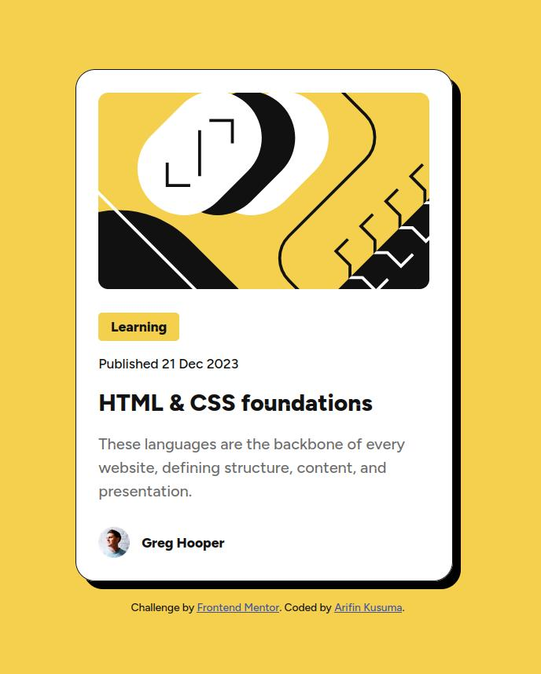
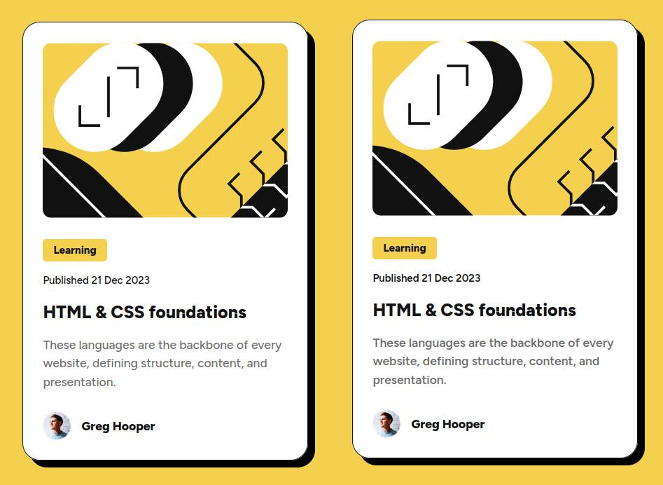
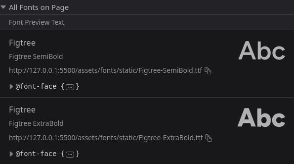
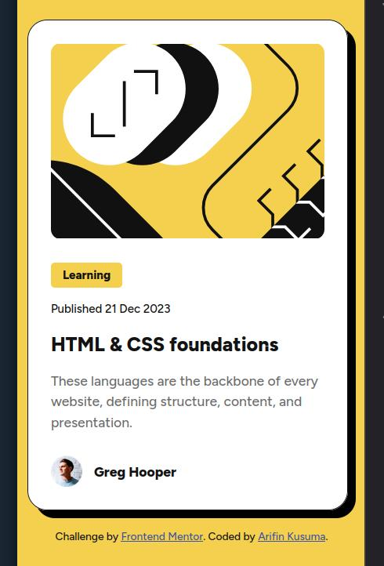
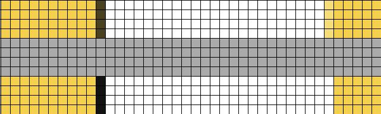
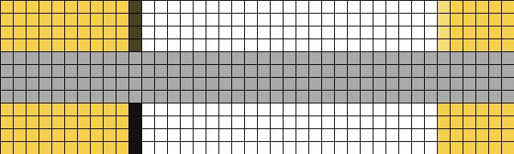
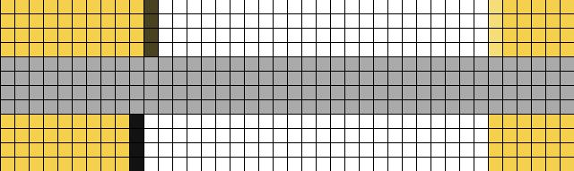
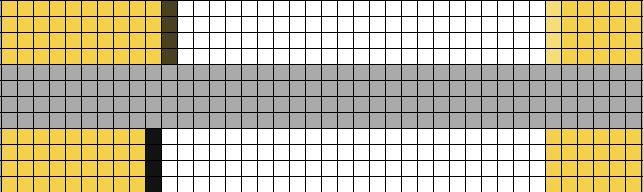

# Frontend Mentor - Blog preview card solution

This is a solution to the [Blog preview card challenge on Frontend Mentor](https://www.frontendmentor.io/challenges/blog-preview-card-ckPaj01IcS). Frontend Mentor challenges help you improve your coding skills by building realistic projects.

## Table of contents

- [Frontend Mentor - Blog preview card solution](#frontend-mentor---blog-preview-card-solution)
  - [Table of contents](#table-of-contents)
  - [Overview](#overview)
    - [The challenge](#the-challenge)
    - [Screenshot](#screenshot)
    - [Links](#links)
  - [My process](#my-process)
    - [Built with](#built-with)
    - [What I learned](#what-i-learned)
      - [Applying HTML Semantics](#applying-html-semantics)
        - [`article` Element as Card Wrapper](#article-element-as-card-wrapper)
        - [Wrap date with `time` Element](#wrap-date-with-time-element)
      - [Setup Local Fonts](#setup-local-fonts)
      - [Implementing Responsiveness](#implementing-responsiveness)
      - [Make HTML Result Close to The Design](#make-html-result-close-to-the-design)
        - [Figma Strokes vs CSS Borders](#figma-strokes-vs-css-borders)
        - [Line Height Issue](#line-height-issue)
        - [Box Size Decimal Values on Browser's Inspector](#box-size-decimal-values-on-browsers-inspector)
    - [Continued development](#continued-development)
    - [Useful resources](#useful-resources)
  - [Author](#author)

## Overview

### The challenge

Users should be able to:

- See hover and focus states for all interactive elements on the page

### Screenshot



### Links

- Solution URL: [https://github.com/finkusuma-dev/frontendmenter-blog-preview-card](https://github.com/finkusuma-dev/frontendmenter-blog-preview-card)
- Live Site URL: [https://finkusuma-dev.github.io/frontendmenter-blog-preview-card](https://finkusuma-dev.github.io/frontendmenter-blog-preview-card)

## My process

### Built with

- Semantic HTML5 markup
- Flexbox
- Mobile-first workflow

### What I learned

#### Applying HTML Semantics

##### `article` Element as Card Wrapper

I coded the card to use the `article` tag to add semantic. But after reading Grace Show's blog [^1] which also uses another "Card" challenge as a case, I changed the `article` to use only `div`. The blog explained that the Card Component will be used many times on a page, and having too much extra semantic will create more noise and not necessary. I wonder if too much semantic is actually annoying for the screen reader users.

##### Wrap date with `time` Element

I found that the `time` tag can be used to wrap date and time. It makes the datetime info readable by the search engine, thus giving a better search results. [^2]

#### Setup Local Fonts

I learned how to setup local variable font with this code:

```css
@font-face {
  font-family: 'Figtree';
  font-weight: 500, 800;
  src: url('./assets/fonts/Figtree-VariableFont_wght.ttf') format('truetype');
}
```

I also tried setting up the local static fonts, but the text looked different. The semi-bold weight appeared thicker.

```css
@font-face {
  font-family: 'Figtree';
  font-weight: 500;
  src: url('./assets/fonts/static/Figtree-SemiBold.ttf') format('truetype');
}
@font-face {
  font-family: 'Figtree';
  font-weight: 800;
  src: url('./assets/fonts/static/Figtree-ExtraBold.ttf') format('truetype');
}
```

Setup with variable font on the left, and static fonts on the right:



In the inspector tab > fonts, it was correctly showing 2 fonts:



#### Implementing Responsiveness

To apply responsive styles, I utilized bootstrap v5 breakpoints [^3]. Using **sm** breakpoint value (576px) as separator between mobile and desktop designs.

```css
@media (min-width: 576px) {
}
```

Also I added padding so there are spaces on the left and right sides. It looks neat on very small screen (320px).



#### Make HTML Result Close to The Design

##### Figma Strokes vs CSS Borders

There is difference between strokes in Figma and borders in CSS. If we look at blog card properties in Figma design, the blog card has stroke **inside** with the padding of 24px.

I tried different values on the CSS padding and also tried CSS border and outline. And these are the pixels to pixels comparison between figma stroke and CSS border (with box-sizing: border-box) or CSS outline.

1. ```css
   border: 0.1rem solid var(--color-gray-950);
   padding: 2.4rem;
   ```

    

2. ```css
   border: 0.1rem solid var(--color-gray-950);
   padding: 2.3rem;
   ```

    

3. ```css
   outline: 0.1rem solid var(--color-gray-950);
   padding: 2.3rem;
   ```

    

4. ```css
   outline: 0.1rem solid var(--color-gray-950);
   padding: 2.4rem;
   ```

    

Using `box-model`: `border-box`, the CSS `border` takes up space and it's drawn inside the element box. While `outline` doesn't take space and it's drawn outside the element box.

So I use the #2 option, using border instead of outline. But I have to reduce the CSS padding to `23px` so the overall card size match with the design. If I use `24px` for padding, it would make the card bigger for 2 pixels on horizontal and on vertical.

##### Line Height Issue

I had issue with the size of text boxes. Despite I set the correct font-family, font-weight, font-size, and line-height, the size of boxes that contain the text are not the same with Figma. After trials and looking at MDN doc [^4], I found out that it is better not to use line-height value with percent as unit.

The reason is that, if we set the `line-height` on the body (and use the percent as unit), the value that is inherited to the children is not the percent value itself, but the calculated value. So the children that have different font size, their line height seems off because they use the parent's line-height.

If we want to use dynamic value on the line height, use it without any units. So instead of `150%`, we should use `1.5` instead.

##### Box Size Decimal Values on Browser's Inspector

I noticed a strange thing when inspecting the box sizes on the inspector tab. Some element dimensions have decimal number. And I discovered that it's related with the Operating System's Display Scale.

If we change the OS Display Scale, for example `125%`, the element's box dimensions can appear to have decimal number. But it only affects elements that we don't explicitly set the size.

For example, I set the blog card's width to `384px`, and I didn't specify the height. On the inspector tab the width was exactly `384px`, but the height was 521.6px. To make it to show round numbers, I must set the page zoom level to 80%, then it showed exactly 522px.

If we do the calculations it makes sense. 100px in 125% display scale is actually scaled up to 125px. If we scale down the 125px to 80%, it goes back to the normal value of 100px.

### Continued development

- Usually when I saw a card component, it didn't have interactive elements inside the card. But the card element itself as a whole is interactive (can get focus, can be clicked, has animation, etc). So this challange is a bit confusing to me. But nevertheless, I did the challenge by adding the anchor element inside the heading, wrapping the text.
- I don't use the `figure` element to wrap the image, as this is only a component. The blog page will list many of this components so the image won't relate with the main content of the page. What is you opinion?
- Do you wrap published date with the `time` element?
- I would be thankful if you're willing to read my discoveries especially [Make HTML Result Close to The Design](#make-html-result-close-to-the-design). And I'll appreciate any thoughts or comments.

### Useful resources

Resources that are directly mentioned are listed in the footnote of this README.

- [@font-face](https://devdocs.io/css/@font-face) & [selecting normal and bold fonts](https://developer.mozilla.org/en-US/docs/Web/CSS/@font-face/font-weight#selecting_normal_and_bold_fonts) - How to setup local fonts.
- https://html5doctor.com/avoiding-common-html5-mistakes/#figure - Why we should avoid using `figure` elements at all time.
- https://www.joshwcomeau.com/css/pixel-perfection/ - This blog gives me general ideas of how to make the html result looks closely similar to the design.

<!-- - [Example resource 1](https://www.example.com) - This helped me for XYZ reason. I really liked this pattern and will use it going forward.
- [Example resource 2](https://www.example.com) - This is an amazing article which helped me finally understand XYZ. I'd recommend it to anyone still learning this concept. -->

<!-- **Note: Delete this note and replace the list above with resources that helped you during the challenge. These could come in handy for anyone viewing your solution or for yourself when you look back on this project in the future.** -->

## Author

- Website - [Arifin Kusuma](https://github.com/finkusuma-dev)
- Frontend Mentor - [@finkusuma-dev](https://www.frontendmentor.io/profile/finkusuma-dev)
- Twitter - [@finkusuma_dev](https://www.twitter.com/finkusuma_dev)

<!-- ## Acknowledgments

This is where you can give a hat tip to anyone who helped you out on this project. Perhaps you worked in a team or got some inspiration from someone else's solution. This is the perfect place to give them some credit.

**Note: Delete this note and edit this section's content as necessary. If you completed this challenge by yourself, feel free to delete this section entirely.** -->

[^1]: https://fedmentor.dev/posts/html-plan-product-preview/. Grace Show's blog, giving example of how to translate a design into HTML.
[^2]: https://developer.mozilla.org/en-US/docs/Web/HTML/Element/time. MDN HTML `time` element documentation.
[^3]: https://getbootstrap.com/docs/5.0/layout/breakpoints/. Bootstrap v5.0 breakpoints.
[^4]: https://developer.mozilla.org/en-US/docs/Web/CSS/line-height#prefer_unitless_numbers_for_line-height_values. MDN CSS `line-height` property documentation
