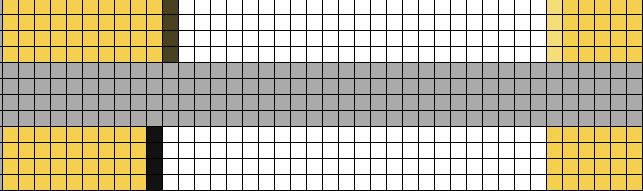
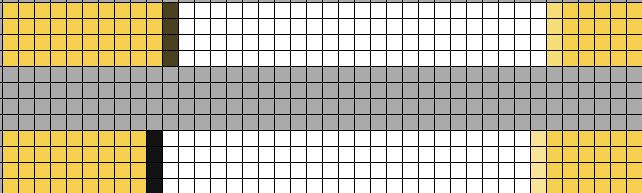

# Frontend Mentor - Blog preview card solution

This is a solution to the [Blog preview card challenge on Frontend Mentor](https://www.frontendmentor.io/challenges/blog-preview-card-ckPaj01IcS). Frontend Mentor challenges help you improve your coding skills by building realistic projects.

## Table of contents

- [Frontend Mentor - Blog preview card solution](#frontend-mentor---blog-preview-card-solution)
  - [Table of contents](#table-of-contents)
  - [Overview](#overview)
    - [The challenge](#the-challenge)
    - [Screenshot](#screenshot)
    - [Links](#links)
  - [My process](#my-process)
    - [Built with](#built-with)
    - [What I learned](#what-i-learned)
      - [Applying HTML Semantics](#applying-html-semantics)
        - [`article` Element as Card Wrapper](#article-element-as-card-wrapper)
        - [Wrap date with `time` Element](#wrap-date-with-time-element)
      - [Setup Local Fonts](#setup-local-fonts)
      - [Implementing Responsiveness](#implementing-responsiveness)
      - [Developing Close to The Design](#developing-close-to-the-design)
        - [Figma Border vs CSS Border](#figma-border-vs-css-border)
        - [Line Height Issue](#line-height-issue)
        - [Box Size Decimal Value on The Browser Inspector](#box-size-decimal-value-on-the-browser-inspector)
    - [Continued development](#continued-development)
    - [Useful resources](#useful-resources)
  - [Author](#author)
  - [Acknowledgments](#acknowledgments)

## Overview

### The challenge

Users should be able to:

- See hover and focus states for all interactive elements on the page

### Screenshot


### Links

- Solution URL: [https://github.com/finkusuma-dev/frontendmenter-blog-preview-card](https://github.com/finkusuma-dev/frontendmenter-blog-preview-card)
- Live Site URL: [https://finkusuma-dev.github.io/frontendmenter-blog-preview-card](https://finkusuma-dev.github.io/frontendmenter-blog-preview-card)

## My process

### Built with

- Semantic HTML5 markup
- Flexbox
- Mobile-first workflow

### What I learned

#### Applying HTML Semantics

##### `article` Element as Card Wrapper

I coded the card to use the `article` tag to add semantic. But after reading Grace Show's blog [^1] which also uses another "Card" challenge as a case, I changed the `article` to use only `div`. The blog explained that the Card Component will be used many times on a page, and having too much extra semantic will create more noise and not necessary. I wonder if too much semantic is actually annoying for the screen reader users.

##### Wrap date with `time` Element

I found that the `time` tag can be used to wrap date and time. It makes the datetime info readable by the search engine, thus giving a better search results. [^2]

#### Setup Local Fonts

I learned how to setup local variable font with this code:

```css
@font-face {
  font-family: 'Figtree';
  font-weight: 500, 800;
  src: url('./assets/fonts/Figtree-VariableFont_wght.ttf') format('truetype');
}
```

I also tried setting up the local static fonts, but the text looked different. The semi-bold weight appeared thicker.

```css
@font-face {
  font-family: 'Figtree';
  font-weight: 500;
  src: url('./assets/fonts/static/Figtree-SemiBold.ttf') format('truetype');
}
@font-face {
  font-family: 'Figtree';
  font-weight: 800;
  src: url('./assets/fonts/static/Figtree-ExtraBold.ttf') format('truetype');
}
```

Setup with variable font on the left, and static fonts on the right:


In the inspector tab > fonts, it was correctly showing 2 fonts:


#### Implementing Responsiveness

To apply responsive styles, I utilized bootstrap v5 breakpoints [^4]. Using sm breakpoint value (576px) as separator between mobile and desktop designs.

```css
@media (min-width: 576px) {
}
```

I also added padding so there are spaces on the left and right sides. It looks neat when the page is viewed on very small screen (320px).


#### Developing Close to The Design

##### Figma Border vs CSS Border

I found that there is difference between how border in Figma behaves vs border in CSS. If we look at Blog card properties it has border **inside** with the padding of 24px.

And these are the comparations between figma border and CSS border (border-box)/outline:

1. ```css
   border: 0.1rem solid var(--color-gray-950);
   padding: 2.4rem;
   ```

    

2. ```css
   border: 0.1rem solid var(--color-gray-950);
   padding: 2.3rem;
   ```

    

3. ```css
   outline: 0.1rem solid var(--color-gray-950);
   padding: 2.3rem;
   ```

    

4. ```css
   outline: 0.1rem solid var(--color-gray-950);
   padding: 2.4rem;
   ```

    

Using `box-model = border-box`, the CSS `border` takes up space and it's drawn inside the element. While `outline` doesn't take space and it's drawn outside the element.

I think the most similar is the #2 option, using border instead of outline. But we have to reduce the CSS padding to `23px` so that the overall card size is similar to Figma.

##### Line Height Issue

- Putting line-height on the body made the elements to have different height than the design. So I must set it on each of the text.
  After looking at the MDN documentation it's mentioned it's preferred to have line-height without unit. If the line height has a unit (like px, rem, rem, or %), the line height is calculated on the parent then the result passed down to the children. If line-height doesn't have a unit (i.e: 1.5), the value is directly passed down to the children and then calculated there against the children font size.

##### Box Size Decimal Value on The Browser Inspector

- The element dimensions that is shown when we hover on Inspector tab is affected by the Operating System Display Scale. For example, on the design the element's width is 200px. On OS that has display scale 125%, using inspector we will see it's width is not exactly 200px but 200px. To make thing normal scale the page to 80%.

### Continued development

- Usually when I saw a card component, it didn't have interactive elements inside the card. But the card element itself as a whole is a navigation to another page. So this challange is a bit confusing to me.
- After reading this blog [^3], I don't wrap the image inside a figure element as this is only a component. The blog will list many of this component so the image won't relate with the main content of the page. What are your thoughts?
- Is the published date usually wrapped with the `time` element?
-

Use this section to outline areas that you want to continue focusing on in future projects. These could be concepts you're still not completely comfortable with or techniques you found useful that you want to refine and perfect.

**Note: Delete this note and the content within this section and replace with your own plans for continued development.**

### Useful resources

Resources that are directly mentioned are listed in the footnote of this README.

- [@font-face](https://devdocs.io/css/@font-face) & [selecting normal and bold fonts](https://developer.mozilla.org/en-US/docs/Web/CSS/@font-face/font-weight#selecting_normal_and_bold_fonts) - How to setup local fonts.
- https://www.joshwcomeau.com/css/pixel-perfection/ - This blog gives me general principe of how to make the result looks closely similar to the design.

<!-- - [Example resource 1](https://www.example.com) - This helped me for XYZ reason. I really liked this pattern and will use it going forward.
- [Example resource 2](https://www.example.com) - This is an amazing article which helped me finally understand XYZ. I'd recommend it to anyone still learning this concept. -->

<!-- **Note: Delete this note and replace the list above with resources that helped you during the challenge. These could come in handy for anyone viewing your solution or for yourself when you look back on this project in the future.** -->

## Author

- Website - [Arifin Kusuma](https://github.com/finkusuma-dev)
- Frontend Mentor - [@finkusuma-dev](https://www.frontendmentor.io/profile/finkusuma-dev)
- Twitter - [@finkusuma_dev](https://www.twitter.com/finkusuma_dev)

**Note: Delete this note and add/remove/edit lines above based on what links you'd like to share.**

## Acknowledgments

This is where you can give a hat tip to anyone who helped you out on this project. Perhaps you worked in a team or got some inspiration from someone else's solution. This is the perfect place to give them some credit.

**Note: Delete this note and edit this section's content as necessary. If you completed this challenge by yourself, feel free to delete this section entirely.**

[^1]: `https://fedmentor.dev/posts/html-plan-product-preview/`.
[^2]: `https://developer.mozilla.org/en-US/docs/Web/HTML/Element/time`.
[^3]: `https://html5doctor.com/avoiding-common-html5-mistakes/#figure`.
[^4]: `https://getbootstrap.com/docs/5.0/layout/breakpoints/`.
[^5]: https://developer.mozilla.org/en-US/docs/Web/CSS/line-height#prefer_unitless_numbers_for_line-height_values.

```

```

```

```

```

```
